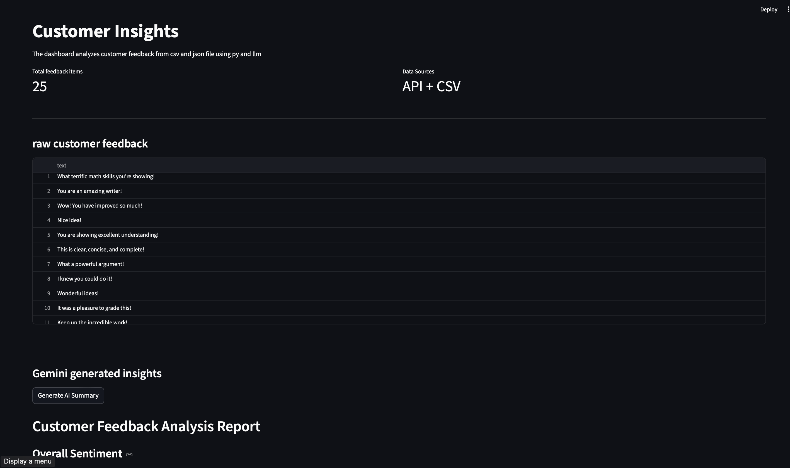
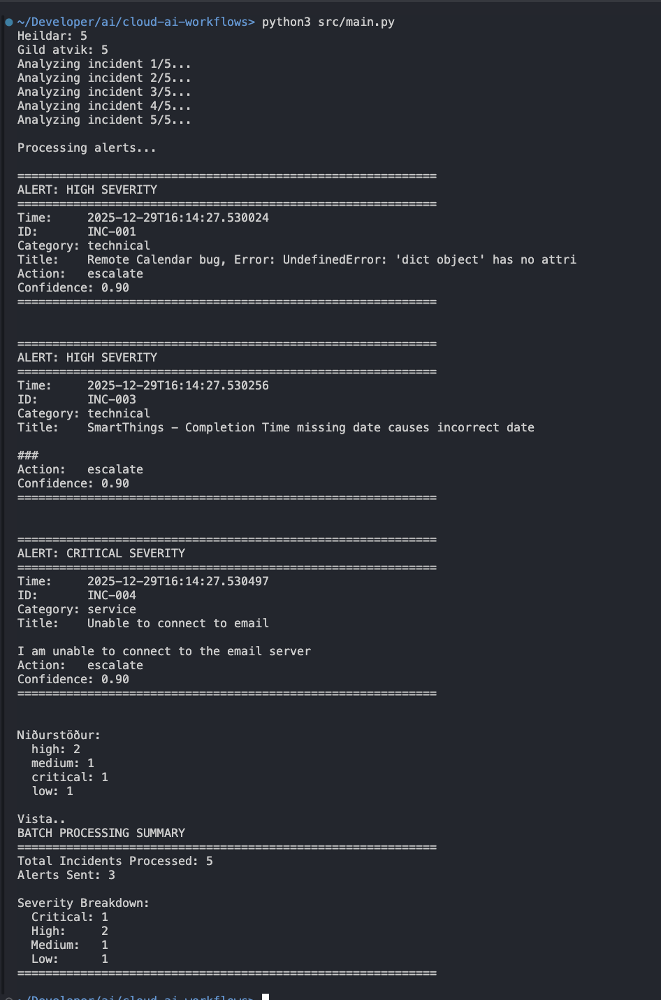

# Automation Verkefnasafn

Þetta repo inniheldur ýmis AI og data analysis automation verkefni sem sýna færni í Python, AI integration, cloud deployment og gagnagreiningu.

## Verkefni

### `ai_data_processing_pipeline/`

Data processing pipeline sem les athugasemdir viðskiptavina úr CSV, hreinsar texta og notar Google Gemini AI fyrir sentiment analysis og samantekt á íslensku.

### `ai_feedback/`

Sækir athugasemdir viðskiptavina úr API, hreinsar textann og notar Google Gemini AI til að búa til markdown skýrslur sem greina sentiment og lykilatriði.

### `ai_insight-dashboard/`

Streamlit dashboard sem safnar saman feedback frá mörgum stöðum og notar Google Gemini AI til að búa til insights með sentiment analysis og ráðleggingum.

### `automation-statistics/`

Dynamic univariate analysis sem er automated og virkar fyrir hvaða pandas DataFrame sem er

### `cloud-ai-workflows/`

Sjálfvirkt incident management kerfi sem sækir tickets úr mörgum áttum, notar AI til að flokka alvarleika atvika og sendir viðvaranir fyrir mikilvæg mál (deployed á AWS með Docker og Terraform).
